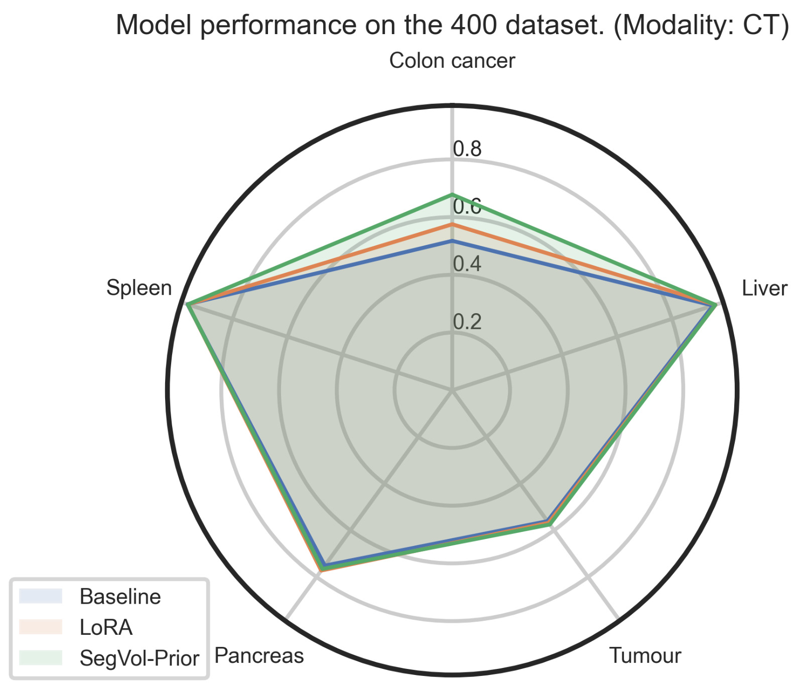
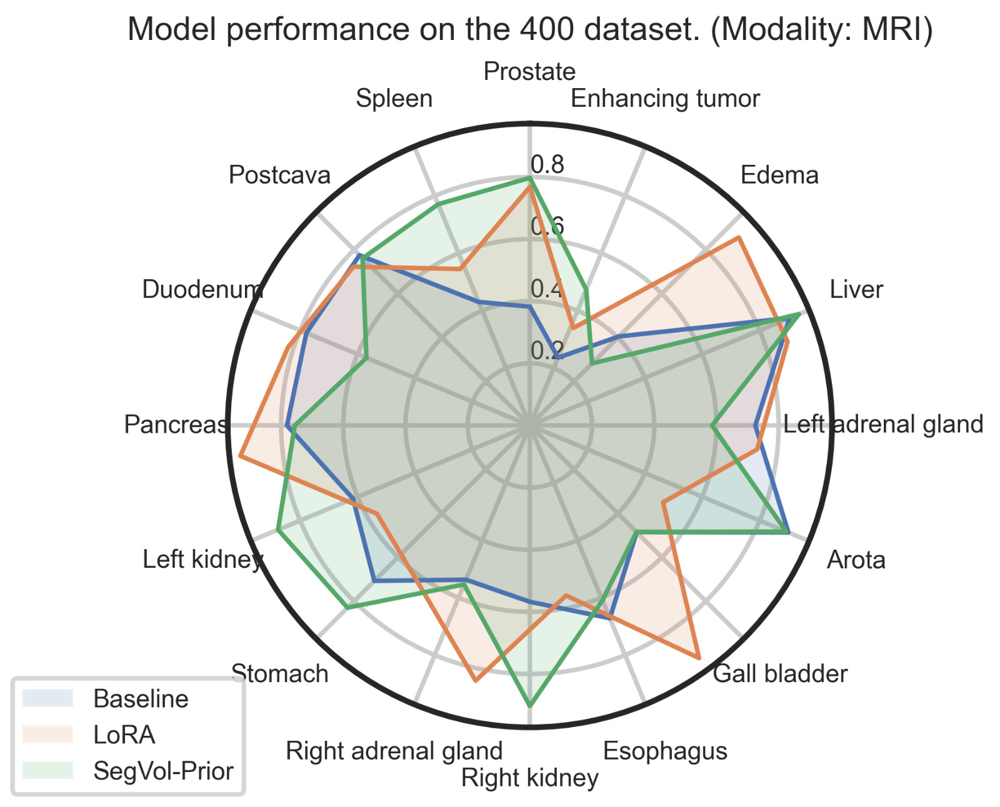

# SegEVOLution: Enhanced Medical Image Segmentation with Multimodality Learning

### Z. Fülöp, S. Mihailov, M. Krastev, M. Hamar, D.A. Toapanta, S. Achlatis

</td>

**Keywords**: 3D medical SAM, volumetric image segmentation, LoRA, Context-Prior Learning

---

This repository contains a reproduction and extension of ["SegVol: Universal and Interactive Volumetric Medical Image Segmentation"](https://arxiv.org/abs/2311.13385) by Du et al. (2023)
using [LoRA adapters](https://arxiv.org/abs/2106.09685) and context priors introduced in ["Training Like a Medical Resident: Context-Prior Learning Toward Universal Medical Image Segmentation"](https://arxiv.org/abs/2306.02416) by Gao et al. (2023)

To read the full report containing detailed information on our  experiments and extension study, please, refer to our [blogpost](blogpost.md).

## Installing Requirements

To get started, clone the repository and install the dependencies using [Poetry](https://python-poetry.org/).

1. Clone the environment 

    ```bash
    git clone https://github.com/SergheiMihailov/adapt_med_seg.git
    ```

2. Activate the existing Poetry environment:

    ```bash
    poetry shell
    ```

3. Install the project dependencies (if not already installed):

    ```bash
    poetry install
    ```

This will activate the primary environment with all necessary dependencies for the main functionalities of this project.

## Datasets Involved 

This project uses the [M3D-Seg](https://arxiv.org/html/2404.00578v1) dataset, which contains 25 datasets involving various medical imaging modalities such as CT of different anatomical structures. The 25 processed datasets are being uploaded to [ModelScope](https://www.modelscope.cn/datasets/GoodBaiBai88/M3D-Seg/summary) and [HuggingFace](https://huggingface.co/datasets/GoodBaiBai88/M3D-Seg).
 Additionally,  we augment this dataset with the following datasets:


| Dataset        | Modality | Link                                                                                     |
|----------------|----------|------------------------------------------------------------------------------------------|
| AMOS_2022      | CT, MRI  | [https://amos22.grand-challenge.org/](https://amos22.grand-challenge.org/)               |
| BRATS2021      | MRI      | [https://www.med.upenn.edu/cbica/brats2021/](https://www.med.upenn.edu/cbica/brats2021/) |
| CHAOS          | CT, MRI  | [https://chaos.grand-challenge.org/](https://chaos.grand-challenge.org/)                 |
| MSD            | CT, MRI  | [http://medicaldecathlon.com/](http://medicaldecathlon.com/)                             |
| SAML_mr_42     | MRI      | [https://kaggle.com/datasets/nguyenhoainam27/saml-mr-42](https://kaggle.com/datasets/nguyenhoainam27/saml-mr-42)         |
| T2-weighted-MRI| MRI      | [https://kaggle.com/datasets/nguyenhoainam27/t2-weighted-mri](https://kaggle.com/datasets/nguyenhoainam27/t2-weighted-mri) |
| promise12_mr   | MRI      | [https://promise12.grand-challenge.org/](https://promise12.grand-challenge.org/)         |

Due to resources constraints, the subsamples of the above datasets are used for training and evaluation. These subdatasets were sampled by taking one random image from the first dataset, then from the second etc. until (200,400,800) reached, or there was no more unique sample in the specific dataset.

| Dataset Size (Num. Samples) | Download Link                                                                                           |
|-------------------|---------------------------------------------------------------------------------------------------------|
| 200               | [Download](https://drive.google.com/file/d/16-WiqBWDaqDUVR8jXJS0ytWou4pic3ly/view?usp=sharing)           |
| 400               | [Download](https://drive.google.com/file/d/19DPk0ZUpr_7md0qcIFpSOJXWoR889q-2/view?usp=sharing)           |
| 800               | [Download](https://drive.google.com/file/d/1VYGv10CHD8gVZ7gRInjbStDH7fji8vq-/view?usp=sharing)           |

Each of these datasets contain the following structure 


```yaml
datasets/
├── M3D_Seg/
├── AMOS_2022/
├── BRATS2021/
├── CHAOS/
├── MSD/
├── SAML_mr_42/
├── T2-weighted-MRI/
└── promise12_mr/
```

## How to use

### Saved checkpoints

We have trained two configurations on top of the SegVol model. These checkpoints, along with the base model from the SegVol paper, can be found below:

|   Model name  | Dice score(%)       |  Download Checkpoint     |
| :--:     | :--:          |:--:               | 
|   segvol_baseline  | TBD |   [Download](https://huggingface.co/BAAI/SegVol/resolve/main/vit_pretrain.ckpt?download=true) | 
|   segvol_lora  | TBD |  [Download](https://drive.google.com/file/d/)   | 
|   segvol_context_prior  | TBD  |  [Download](https://drive.google.com/file/d/) |

### Training Pipeline

The training pipeline is defined in `adapt_med_seg/train.py`. To train the model, run:

```bash
python -m adapt_med_seg.train \
      --model_name ${MODEL_NAME} \ # i.e "segvol_baseline"
      --dataset_path ${DATASET} \
      --modalities CT MRI \
      --epochs 10 \
      --lora_r 16 \     # Optional: sets the rank of the LoRA adapter.
      --lora_alpha 16   # Optional: sets the alpha value for the LoRA adapter.
```

### Evaluation Pipeline

The evaluation pipeline is defined in `adapt_med_seg/pipelines/evaluate.py`. To evaluate the model, run:


```bash
python -m adapt_med_seg.eval \
      --model_name ${MODEL_NAME} \ # i.e "segvol_baseline"
      --dataset_path ${DATASET} \
      --modalities CT MRI \
      --ckpt_path ${CHECKPOINT_PATH} \ i.e "segvol_lora.ckpt"
      --lora_r 16 \ # Optional but need to match the training lora_r of the checkpoint: sets the rank of the LoRA adapter.
      --lora_alpha 16 \ # Optional but need to match the training lora_rof the checkpoint: sets the alpha value for the LoRA adapter.
```

## Demo
This section provides an overview of the available Jupyter notebooks designed to help you with various tasks such as preprocessing data, performing inference, and visualizing results.

### Notebooks

Several Jupyter notebooks are provided for various tasks such as preprocessing, inference, and visualization:

- `notebooks/inference_colab.ipynb`: Inference on Colab.
- `notebooks/inference.ipynb`: General inference notebook.
- `notebooks/preprocess.ipynb`: Data preprocessing steps.
- `notebooks/process_results.ipynb`: Processing and analyzing results.
- `notebooks/SegVol_initial_tryouts.ipynb`: Initial segmentation volume tryouts.
- `notebooks/vis.ipynb`: Visualization of results.
- `notebooks/zsombor_balance_amos.py`: Script for balancing AMOS dataset.
- [Training notebook](https://colab.research.google.com/drive/1qxhdcgjt_ez7syjsubQvJjffpCeaZ6Fa?usp=sharing): Colab notebook for running model training.

To run these notebooks, activate the Poetry environment and start Jupyter Notebook:

```bash
poetry shell
jupyter notebook
```
## 🏆 Performance of SegEVOLution using our pre-trained models

<table align="center">
  <tr align="center">
    <td>
      
    </td>
    <td>
      
    </td>
  </tr>
  <tr align="left">
    <td colspan="2"><b>Figure 4.</b> Combined view of our results over different modalities and organs.</td>
  </tr>
</table>


## Citation
If you find this repository helpful, please consider citing:

```
@misc{SegEVOLution2024,
    title = {SegEVOLution: Enhanced Medical Image Segmentation with Multimodality Learning},
    author = {Zsombor, Fülöp and Serghei, Mihailov and Matey, Krastev and Miklos, Hamar and Danilo, Toapanta, Stefanos, Achlatis},
    year = {2024},
    howpublished = {\url{https://github.com/SergheiMihailov/adapt_med_seg.git}},
}
```

## Acknowledgement

Thanks for the following amazing works:
[SegVol](https://github.com/BAAI-DCAI/SegVol)

[HuggingFace](https://huggingface.co/).

[CLIP](https://github.com/openai/CLIP).

[MONAI](https://github.com/Project-MONAI/MONAI).

[Zenodo](https://zenodo.org/).


