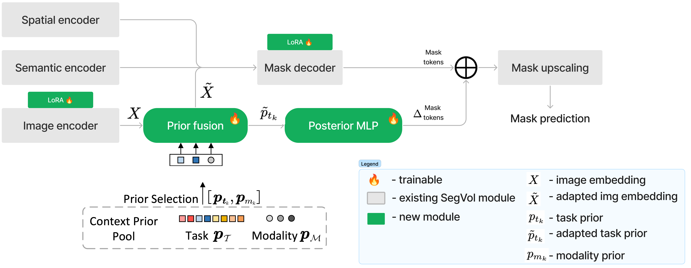

# SegEVOLution: Enhanced Medical Image Segmentation with Multimodality Learning

### Z. Fülöp, S. Mihailov, M. Krastev, M. Hamar, D.A. Toapanta 
> **Supervised by**: Stefanos Achlatis, s.s.achlatis@uva.nl

## Introduction

Medical image segmentation (MIS) is a major direction computer vision which targets accurate delineation of anatomical structures -- crucial for diagnosis, treatment planning, and disease monitoring. The development of universal models that can perform well across different medical imaging modalities, in particular, is a challenging task. Firstly, because the modalities, notably Computed Tomography (CT), Magnetic Resonance Imaging (MRI), Endoscopy, and Ultrasound (US), each employ fundamentally different techniques. Secondly, as each modality targets different parts of the human anatomy, resulting in substantial variations in label space and data distribution. Thirdly, unlike conventional images, acquiring large-scale medical data is challenging due to the high costs of annotation and privacy concerns. This difficulty is exacerbated in the case of volumetric (3D) medical images, which are particularly hard to obtain, store, and annotate, and require significant computational resources for processing [[1]](#ref1). Consequently, developing a universal model that demonstrates robust and consistent performance across the entire MIS domain is exceptionally challenging.

This study focuses on SegVol [[1]](#ref1), a foundation model designed for MIS and pre-trained on CT volumes. Notably, SegVol exhibits promising zero-shot performance on MRI data. Our objective is to evaluate the transferability of SegVol's CT pre-training to MRI data and extend its capabilities through fine-tuning techniques and enhanced prompt augmentation. Our approach comprises two main strategies: First, we quantitatively evaluate SegVol's performance under controlled input distribution shifts within the MRI modality. Second, we enhance SegVol's performance in the MRI domain by employing advanced prompts, parameter-efficient fine-tuning, and modality-specific priors. Additionally, we assess the impact of fine-tuning on SegVol's performance in the CT domain. Broadly, this work seeks to provide insights into the adaptability of MIS models across different medical imaging modalities.

## Background

Recently, several large-scale models have been proposed to address the challenges of universality and robustness in image segmentation across both natural and medical domains. Notably, the Segment Anything Model (SAM) [[2]](#ref2) is a large pre-trained foundation model specifically designed for image segmentation, demonstrating impressive results on various tasks, including segmentation of out-of-distribution samples. However, subsequent studies have revealed that despite SAM’s exceptional performance on natural images, it significantly underperforms on most medical image segmentation (MIS) tasks, such as organ, tumor, and lesion segmentation across CT, MRI, and Ultrasound modalities [[3]](#ref3) [[4]](#ref4) [[5]](#ref5) [[6]](#ref6) [[7]](#ref7).

To address these limitations, several new methods have been proposed to adapt SAM for improved performance on MIS tasks [[8]](#ref8) [[9]](#ref9) [[10]](#ref10). SAM-Med2D [[9]](#ref9) is a fine-tuned version of SAM trained on 19.7 million 2D masks from various body parts and imaging techniques. This version incorporates learnable adapter layers in each Transformer block, allowing the model to acquire domain-specific knowledge crucial for medical image segmentation. Spatial prompts such as point prompts, bounding box prompts, and mask prompts play crucial roles in guiding the model to specific regions of interest within medical images. Despite the adaptation, treating 3D images such as CT and MRI as independent 2D slices is suboptimal.

Haoyu Wang et al. (2023) [[10]](#ref10) reformulated SAM into a 3D architecture, called SAM-Med3D, and trained it on 131,000 3D CT and MRI masks across 247 categories. Unlike SAM-Med2D, which treats volumetric data as individual 2D slices, SAM-Med3D processes the data in its entirety using a 3D decoder. This method allows SAM-Med3D to capture more spatial context and generate higher quality masks with significantly fewer point prompts compared to SAM-Med2D. However, SAM-Med3D still faces challenges in processing large inputs due to its volumetric design and does not support segmentation using semantic prompts.

Most recently, Du et al. (2024) proposed SegVol [[1]](#ref1), a volumetric model pre-trained on 96,000 CT images from various segmentation datasets of over 200 anatomical structures. The authors claim that SegVol generalizes remarkably well to unseen data, achieving state-of-the-art zero-shot performance on most MIS tasks. SegVol employs composite-type prompts that combine semantic and spatial information, significantly enhancing its segmentation accuracy. Importantly, SegVol also supports semantic-only prompt which enables a wider range of applications. Additionally, the authors introduced a method for inference called zoom-in-zoom-out, which significantly reduces the computational cost of volumetric image segmentation while effectively utilizing the 3D structure's information. Despite SegVol being explicitly trained on CT images, it demonstrates good zero-shot performance in the MRI domain, underscoring its versatility.

To develop a truly universal medical image segmentation model, Gao et al. (2024) proposed Hermes [[11]](#ref11), which learns task- and modality-specific priors inspired by the training program of medical radiology residents. Hermes integrates these priors through context-aware sampling [[12]](#ref12) based on the input image's modality (e.g., MRI, CT, PET) and the task description. This approach allows Hermes to adapt dynamically to different segmentation challenges, offering a significant improvement over single-task models. Contextual prompts derived from the learned priors are used to adapt the model’s segmentation strategy dynamically. Hermes has been shown to be competitive with, or even outperform, state-of-the-art task- and modality-specific approaches across a wide range of benchmarks.

## Overview of SegVol

The SegVol model, proposed by [1](#ref1), is a 3D foundation segmentation model, achieving state-of-the-art performance on common medical image segmentation benchmarks. It supports universal and interactive segmentation by combining the learned output representations of a Vision Transformer (ViT) with three different types of prompting techniques, namely text, bounding box and point prompts. 

The success of the SegVol model can partly be attributed to the large pre-training corpus, which consists of $96\, 000$ unlabelled Computerized Tomography (CT) volumes as well as its fine-tuning dataset, which consists of a diverse set of $6\,000$ additional CT volumes. Second, its well-designed arcchitecture allows for powerful and interactive image segmentation, providing a strong basis for practical applications. Finally, at inference time it employs a so-called zoom-in-zoom-out technique, guided by the prompts to effectively reduce the computation demand for volumetric segmentation.

In this section, we will briefly introduce the design and architecture of SegVol as well as a description of the M3D-Seg dataset, used for fine-tuning the model. Next, we show some preliminary experiments we conducted to verify the performance of this model in a variety of aspects. Finally, we summarise our findings and further motivate our work.

### Architecture

The SegVol model takes inspiration from the Segment Anything Model (SAM) [1](#ref1),[2](#ref2) in its architecture. Concretely, it consists of the following main parts (also see [Figure 1, left](#fig1)):
1. **Vision Transformer (ViT)**: responsible for computing powerful representations of the input image.
2. **Prompt Encoder (PE)**: responsible for mapping different types of prompts to the same vector space as the output representations of the ViT. The supported prompt types are the following:
  1. **Text prompt**: encodes semantic information about the task at hand. Given a task (e.g. liver segmentation), it uses the pre-trained text encoder of the CLIP model, evaluated using the template 

  		`A Computerized Tomography (CT) of a {} ` (e.g. liver)
  2.  **Point prompt**: specify $n$ points within the organ to help guide the search of the model. Following CLIP [2](#ref2), the model computes the positional encoding of these points
  3. **Bounding box prompt**: specify a 3D box around the target organ to help guide the search of the model. Again, the positional encodings of the corners of the bounding box are used.

	Overall, the prompt encoder computes representations for each of the provided prompt types and concatenates them.

4. **Fusion Encoder**: a lightweight sequential application of two transformer blocks, applying bi-directional self-attention on the concatenated input of the image- and prompt embeddings computed by the earlier modules.
5. **Mask Decoder**: Based on the output of the fusion encoder, compute mask predictions using a Multi-Layer Perceptron (MLP) block. These predictions are then used in a standard sliding window inference to find the mask with highest *Intersection over Union (IoU)* score.

**Zoom-out-zoom-in mechanism**:  Given that 3D medical images typically have very high resolution[^*], and naively down-sampling them would cause significant information loss, [1](#ref) employ a so-called zoom-out-zoom-in mechanism to reduce the memory overhead at inference time. Their method is simple. Given an input image and a bbox or point prompt, they produce two inputs to the model; one, which is a downsampled version of the input (zoom-out) and another which is a full resolution, cropped image around the provided prompt (zoom-in). This way, instead of having to compute image representations for the whole input, the model can first produce a local representation of the part deemed relevant by the provided prompt, and another, which helps put this representation in the context of the whole image. As a result, the computation overhead significantly decreases[^**].

Albeit the obvious benefits of this method, it is important to note that at test time, it is our understanding that the bounding box prompts were generated from the ground truth labels, which makes the zoom-in images always *perfectly aligned* with the target organ. This may indeed leak ground-truth information to the model at inference time and obstruct the reported test results. To investigate this, we performed some preliminary experiments by applying random translations to the generated bounding box prompts, and found that the performance indeed decreases significantly TODO: run experiment and report it (maybe in the appendix?). 

**Training**:  The SegVol model was trained in two phases; *pre-training* and *fine-tuning*. First, the ViT was pre-trained on a large training corpus, consisting of $96\, 000$ unlabelled volumetric CT images. During this phase, the SimMIM algorithm [22](#ref22) was used to obtain a weak supervision signal and guide the image encoder to map to a feature-ritch embedding space, tailored specifically for the task of image segmentation. 

Next, once the pre-training of the ViT concluded, the authors employed supervised fine-tuning of the entire model on a set of $6\, 000$ labelled CT images, including $150\,000$ ground truth segmentation masks. 

Overall, the above architecture is a well-defined extension of the SAM architecture, adapted specifically for the task of volumetric medical image segmentation. While SAM was shown to perform poorly in the medical domain ([4](#ref4), [5](#ref5), [6](#ref6), [7](#ref7)), SegVol consistently out-performs other state-of-the-art methods. By employing zoom-out-zoom-in inference and also through its design, it is not infeasible to perform interactive segmentation in a low-resource environment, paving the way for medical practitioners to use it in their day-to-day activities.

[^*]: e.g. a typical CT volume has dimensions $(256\times 256\times200)$ which amounts to $13\,107\,200$ voxels, in 32 bit floating point representation, this takes $~250\text{MiB}$​.
[^**]: suppose the target organ takes up $50\%$ of the whole image (an over-approximation in our experience), then the zoom-in image size is $1/2$ of the original input and the zoom-out can also be down-sampled by $50\%$. This, combined with the $O(n^2)$ asymptotic running time of the self-attention mechanism, leads to a quadratic increase in performance.

## Datasets

In our work, we consider two *modalities* from the volumetric medical image segmentation domain: Computerized Tomography (CT) and Magnetic Resonance Imaging (MRI) and employ different adaptation methods to improve its performance on different modalities and tasks. For this reason, we re-used part of the M3D-Seg dataset, released by [33](#ref33), and extended it using 6 public MRI segmentation datasets for training. Concretely, we used four subsets of the M3D-Seg dataset, as well as six publicly available MRI segmentation datasets. Please refer to [Table 1](#tab1) for a comprehensive summary.

TODO: should I discuss the individual datasets in more detail? e.g. BRATS actually has 5004 samples because it was pre-processed with 4 different techniques (form of data augmentation from our prespective)

### Computerized Tomography Data

We reused the M3D-Seg dataset, used in the fine-tuning phase of the SegVol model [1](#ref1). It was released by [33](#ref33), and is currently one of the largest volumetric image segmentation datasets available. It consists of $5\,771$ CT images, along with $149\,000$ segmentation masks, from a total of $25$ publicly available datasets. The authors made an effort to standardize the data across a wide range of data quality, format and sample sizes. Interstingly, the preprocessing pipeline used is relatively simple compared to common practices in the medical image segmentation domain. 

Concretely, given a raw volumetric image file (typically in [NIfTI format](https://en.wikipedia.org/wiki/Neuroimaging_Informatics_Technology_Initiative#:~:text=The%20Neuroimaging%20Informatics%20Technology%20Initiative,using%20Magnetic%20Resonance%20Imaging%20methods.)), they first extract the foreground of the image (all voxels of intensity $>$ mean intensity), take the resulting image's $5^\text{th}$ and $95^\text{th}$ percentile, and standardize it using the mean and std of the foreground. Next, for each dataset, they pre-process the ground truth segmentation masks by splitting the different segmentation categories along the first dimension and then concatenating them, to obtain a $K\times H\times W\times D$ tensor of segmentation masks. Finally, they store the resulting image and mask representations as numpy binaries encoded with floating point numbers with 32bit precision. The authors apply this procedure on each raw image sample from the $25$ different CT image datasets to obtain the M3D-Seg dataset [33](#33).

### Magnetic Resonance Imaging Data

To successfully train our models to recognise MRI data, we selected $6$ different publicly available datasets, which consist of $1\,572$ MRI volumes and $12\,486$ ground truth segmentation masks. Please refer to [Table 1](#tab1) for an overview of the datasets we have used. We pre-process each of these samples in the same way as M3D-Seg but also include a per-sample modality information. For example, the CHAOS [24](#ref24) dataset contains both CT and MRI data, so it is important to be able to distinguish between them in our dataset representation. 

### Data loading

To combine the two sources of data; the M3D-Seg dataset [33](#ref33) and our collection of MRI datasets, we use the same pre-processing logic and obtain a combined dataset, which we can use for training and evaluation of our models. In practice, noting that the available CT data is an order of magnitude larger than the MRI data we have obtained, we only select a specific subset of the M3D-Seg dataset. This way we get a balanced training and validation set over the two modalities.

| Dataset                                                     | Segmentations                                               | MRI        | CT   |
| ----------------------------------------------------------- | ----------------------------------------------------------- | ---------- | ---- |
| CHAOS [24](#ref24)                                          | liver, (left and right) kidneys, spleen                     | 30 (x2)    | 20   |
| M3D-Seg 0001 (HaN-Seg) [33](#ref33), [26](#ref26)           | 29 different organs and tissues from the head and neck area | 59         | 300  |
| M3D-Seg 0008 (Pancreas-CT) [33](#ref33), [23](#ref23)       | Pancreas                                                    | 59         | 300  |
| M3D-Seg 0020 (MSD-Liver) [33](#ref33), [25](#ref25)         | Liver, tumor                                                | 59         | 300  |
| AMOS 2022 [27](#ref27)                                      | 15 different abdominal organs                               | 59         | 300  |
| BraTS 2021 Task 1 [28](#ref28)                              | 3 categories of brain tumor tissue                          | 1 251 (x4) | \-   |
| MSD\_Prostate [25](#ref25)                                  | prostate core and surrounding tissue                        | 32         | \-   |
| PROMISE-12 [29](#ref29)                                     | prostate                                                    | 80         | \-   |
| SAML dataset [30](#ref30)                                   | prostate                                                    | 116        | \-   |
| T2 Weigthted MRI Prostate Dataset [31](#ref31) [32](#ref32) | prostate                                                    | 114        | \-   |
<table name='tab1'>
<tr>
<td colspan="4"><b>Table 1.</b> Datasets used in our experiments. We re-used four sub-sets of the M3D seg dataset and pre-processed an additional $6$ datasets to obtain MRI data of comparable size. The number of CT and MRI samples per dataset can be seen on the last two columns. Numbers with a  ugly, I know. making all of this a html table, the links don't work, doing it in markdown, we can't have 'colspan' </td>
</tr></table>

[^3]: https://huggingface.co/datasets/GoodBaiBai88/M3D-Seg

## Methodology

### Low Rank Adaptation (LoRA)

LoRA (Low-Rank Adaptation) is a technique used to adapt large pre-trained models to downstream tasks without significantly increasing computational requirements [[13]](#ref13). LoRA reduces the training time and memory footprint of training large models by decomposing the updates of the model's weights into low-rank components.
In this study, we use LoRA to adapt SegVol (initially trained on CT volumes) to directly improve its performance on MRI data. We aim to leverage the strengths of the pre-trained model while tailoring it to a different medical imaging modality.

### Mixture of Adapters (MoA)

Mixture of Adapters (MoA) is an advanced adaptation technique inspired by the Mixture of Experts (MoE) approach [[14]](#ref13) that utilizes multiple lightweight adapter modules within a model to handle diverse tasks and modalities. Each adapter specializes in a specific task or modality, and the model dynamically selects and combines these adapters during inference  [[8]](#ref8) why put this reference?. A special case of this approach uses `top-1`  gating, effectively

### Context-prior learning
Medical imaging data is characteristically heterogeneous and diverse: different organs have completely different shapes and positions, and image features vary wildly across modalities, such as between CT and MRI. Thus, MIS models are primarily designed for specific tasks and modalities. The downside of such an approach is that models are confined to specific tasks for which they have been trained. They do not exploit similarities across tasks and modalities, which seems wasteful given the scarcity of available medical datasets. However, training across a variety of tasks and modalities requires approaches that are designed to be able universal. 

[11](#ref11) explore the universal medical image segmentation paradigm. They propose integrating learnable per-modality and per-task tokens, called **context priors**, into existing MIS architectures. Context priors are used to adapt the image representation to the specified task and modality, essentially conditioning the segmentation. This is done by passing both the context prior tokens and the output of the image encoder through a transformer block, called **prior fusion**. The mask decoder will then use the adapted image representation, instead of the original one.

Furthermore, the context priors, after being passed through the prior fusion block and interacting with the image representation, are called **posterior tokens**. Posterior tokens combine the information from context prior tokens and image representation via the prior fusion mechanism, and are used to generate **posterior prototypes**. The final segmentation output of the model is the inner product of the mask decoder output with the posterior prototypes, where posterior prototypes serve as class classifiers.

<table align="center" name="fig3">
  <tr align="center">
      <td></td>
  </tr>
  <tr align="left">
    <td colspan="2"><b>Figure 3.</b> Proposed architecture combining SegVol model and Hermes context-prior framework. This hybrid model integrates SegVol’s volumetric segmentation with Hermes’s context-prior learning.</td>
  </tr>
</table>

We apply the approach taken by Hermes to the pre-trained SegVol model, with slight modifications, as described below. You can refer to the figure above for an overview.
- **Context prior pool.** Following the approach from the Hermes paper, we introduce a context prior pool. Whenever the model encounters a new modality or task (which are known in advance per dataset), a new context prior is added to the pool. **Prior fusion.** To adapt the image encoder output and obtain the posterior tokens, we introduce the prior fusion attention module. 
- **Posterior prototype.** We use the posterior tokens obtained from prior fusion to adapt the mask decoder output. As opposed to Hermes, we use the posterior tokens as an additive adaptation to the mask decoder output tokens, rather than as a multiplicative adaptation over the feature map resulting from the mask decoder. We take this approach as we focus on single-class tasks, thus posterior prototypes as presented in the original paper would not be meaningful to our case. Ablation studies show that adding posterior information to the mask decoder output tokens is effective (TODO). 
- **Fine-tuning the SegVol image encoder and mask decoder.** In Hermes, the task and modality priors are learned together with the backbone. Since SegVol is pre-trained, we fine-tune its image encoder and mask decoder using LoRA for better integration with the Hermes architecture. 
- **Modality prediction loss.** Unlike in Hermes, we do not implement the auxiliary modality prediction loss, since it was shown, in the original paper, to only yield a minor improvement.

## Results
Based on preliminary evaluation, we have reproduced SegVol performance on CT and MRI data, obtaining results as reporting in the SegVol paper.

### Table #: External Validation Results of LoRA and Context Priors on MRI and CT Datasets

| **Method**       | **Training Data**                         | **Expected Outcome**                                    | **Results**                          |
|---------------------------|-------------------------------------------|--------------------------------------------------------|-------------------------------------|
| **SegVol Baseline**       | MRI + CT (all)                            | Baseline performance for comparison                    | 0.729                            |
| **LoRA**                  | MRI + CT (all)                            | Baseline performance for comparison                                  | TBD                                 |
|                           | CT (all)                                  | Baseline performance on CT                             | TBD                                 |
|                           | MRI (all)                                 | Baseline performance on MRI                            | TBD                                 |
|                           | MRI Prostate                              | Performance on MRI prostate                            | TBD                                 |
|                           | MRI Brain                                 | Performance on MRI brain                               | TBD                                 |
| **Context Priors**        | MRI + CT (all)                                   | Baseline performance for comparison            | TBD                                 |
|         | CT (all)                                  | Expected to perform better than LoRA on CT             | TBD                                 |
|                           | MRI (all)                                 | Expected to perform better than LoRA on MRI            | TBD                                 |
|                           | MRI Prostate                              | Potential improvement over LoRA on MRI prostate        | TBD                                 |
|                           | MRI Brain                                 | Potential improvement over LoRA on MRI brain           | TBD                                 |

*Note: The results are presented as mean Dice scores.*

### Table #: Dice Scores for Different Organs Using SegVol Baseline, LoRA, and Context Priors

| **Organ**                  | **SegVol Baseline (MRI + CT)** | **LoRA (MRI + CT)**       | **Context Priors (MRI + CT)** | **Results** |
|----------------------------|--------------------------------|---------------------------|-------------------------------|-------------|
| **Prostate**               | TBD                            | TBD                       | TBD                           | TBD         |
| **Brain**                  | TBD                            | TBD                       | TBD                           | TBD         |

*Note: The results are presented as mean Dice scores.*

## Discussion and Conclusion

## Invidual Contributions

| **Name**       | **Contribution**                                                                                   |
|----------------|-----------------------------------------------------------------------------------------------------|
| Z. Fülöp       |  |
| S. Mihailov    |  |
| M. Krastev     |  |
| M. Hamar       |  |
| D.A. Toapanta  |  |

## References

<a name="ref1">[1]</a>: Du, Yuxin, Fan Bai, Tiejun Huang, and Bo Zhao. 2024. “SegVol: Universal
and Interactive Volumetric Medical Image Segmentation.”
<https://arxiv.org/abs/2311.13385>.

<a name="ref2">[2]</a>: Kirillov, Alexander, Eric Mintun, Nikhila Ravi, Hanzi Mao, Chloe
Rolland, Laura Gustafson, Tete Xiao, et al. 2023. “Segment Anything.” In
*Proceedings of the IEEE/CVF International Conference on Computer
Vision*, 4015–26.

<a name="ref3">[3]</a>: Ma, Jun, Yuting He, Feifei Li, Lin Han, Chenyu You, and Bo Wang. 2024.
“Segment Anything in Medical Images.” *Nature Communications* 15 (1):
654.

<a name="ref4">[4]</a>: Ji, Ge-Peng, Deng-Ping Fan, Peng Xu, Ming-Ming Cheng, Bowen Zhou, and
Luc Van Gool. 2023. “SAM Struggles in Concealed Scenes–Empirical Study
on" Segment Anything".” *arXiv Preprint arXiv:2304.06022*.

<a name="ref5">[5]</a>: Sheng, He, Rina Bao, Jingpeng Li, Patricia Grant, and Yangming Ou. 2023.
“Accuracy of Segment-Anything Model (SAM) in Medical Image Segmentation
Tasks,” April.

<a name="ref6">[6]</a>: Ji, Wei, Jingjing Li, Qi Bi, Tingwei Liu, Wenbo Li, and Li Cheng. 2024.
“Segment Anything Is Not Always Perfect: An Investigation of Sam on
Different Real-World Applications.” Springer.

<a name="ref7">[7]</a>: Roy, S, T Wald, G Koehler, MR Rokuss, N Disch, J Holzschuh, D Zimmerer,
KH Maier-Hein, and MD SAM. n.d. “Zero-Shot Medical Image Segmentation
Capabilities of the Segment Anything Model. arXiv 2023.” *arXiv Preprint
arXiv:2304.05396*.

<a name="ref8">[8]</a>: Wu, Junde, Wei Ji, Yuanpei Liu, Huazhu Fu, Min Xu, Yanwu Xu, and Yueming
Jin. 2023. “Medical SAM Adapter: Adapting Segment Anything Model for
Medical Image Segmentation.” <https://arxiv.org/abs/2304.12620>.

<a name="ref9">[9]</a>: Cheng, Junlong, Jin Ye, Zhongying Deng, Jianpin Chen, Tianbin Li, Haoyu
Wang, Yanzhou Su, et al. 2023. “Sam-Med2d.” *arXiv Preprint
arXiv:2308.16184*.

<a name="ref10">[10]</a>: Wang, Haoyu, Sizheng Guo, Jin Ye, Zhongying Deng, Junlong Cheng, Tianbin
Li, Jianpin Chen, et al. 2023. “Sam-Med3d.” *arXiv Preprint
arXiv:2310.15161*.

<a name="ref11">[11]</a>: Gao, Yunhe, Zhuowei Li, Di Liu, Mu Zhou, Shaoting Zhang, and Dimitris N.
Metaxas. 2024. “Training Like a Medical Resident: Context-Prior Learning
Toward Universal Medical Image Segmentation.”
<https://arxiv.org/abs/2306.02416>.

<a name="ref12">[12]</a>: Xue Wang and Zhanshan Li and Yongping Huang and Yingying Jiao, 2022, Multimodal medical image segmentation using multi-scale context-aware network

<a name="ref13">[13]</a>: Hu, Edward J., Yelong Shen, Phillip Wallis, Zeyuan Allen-Zhu, Yuanzhi Li, Shean Wang, Lu Wang, and Weizhu Chen. 2022. “LoRA: Low-Rank Adaptation of Large Language Models.” *arXiv preprint arXiv:2106.09685*. <https://arxiv.org/abs/2106.09685>.

<a name="ref14">[14]</a>: Shazeer, Noam, Azalia Mirhoseini, Krzysztof Maziarz, Andy Davis, Quoc Le, Geoffrey Hinton, and Jeff Dean. 2017. “Outrageously Large Neural Networks: The Sparsely-Gated Mixture-of-Experts Layer.” In *International Conference on Learning Representations*. <https://arxiv.org/abs/1701.06538>.

<a id="ref15">[15]</a>: Geert Litjens, Bram van Ginneken, Henkjan Huisman, Wendy van de Ven, Caroline Hoeks, Dean Barratt, and Anant Madabhushi. “PROMISE12: Data from the MICCAI Grand Challenge: Prostate MR Image Segmentation 2012”. Medical Image Analysis. Zenodo, June 7, 2023. https://doi.org/10.5281/zenodo.8026660

<a id="ref16">[16]</a>: Sebastian Gibala, Rafal Obuchowicz, Julia Lasek, Zofia Schneider, Adam Piorkowski, Elzbieta Pociask, & Karolina Nurzynska. (2023). Prostate MRI T2-weighted images with peripherial and trasition zone segmentations including corresponding PIRADS and PSA values [Data set]. Zenodo. https://doi.org/10.5281/zenodo.7676958

<a id="ref17">[17]</a>: U.Baid, et al., "The RSNA-ASNR-MICCAI BraTS 2021 Benchmark on Brain Tumor Segmentation and Radiogenomic Classification", arXiv:2107.02314, 2021(opens in a new window).

<a id="ref18">[18]</a> B. H. Menze, A. Jakab, S. Bauer, J. Kalpathy-Cramer, K. Farahani, J. Kirby, et al. "The Multimodal Brain Tumor Image Segmentation Benchmark (BRATS)", IEEE Transactions on Medical Imaging 34(10), 1993-2024 (2015) DOI: 10.1109/TMI.2014.2377694 (opens in a new window)

<a id="ref19">[19]</a> S. Bakas, H. Akbari, A. Sotiras, M. Bilello, M. Rozycki, J.S. Kirby, et al., "Advancing The Cancer Genome Atlas glioma MRI collections with expert segmentation labels and radiomic features", Nature Scientific Data, 4:170117 (2017) DOI: 10.1038/sdata.2017.117

<a id="ref20">[20]</a> Antonelli, M., Reinke, A., Bakas, S. et al. The Medical Segmentation Decathlon. Nat Commun 13, 4128 (2022). https://doi.org/10.1038/s41467-022-30695-9

<a id="ref21">[21]</a> Quande Liu, Qi Dou, Pheng Ann, Heng. Shape-aware Meta-learning for Generalizing Prostate MRI Segmentation to Unseen Domains. International Conference on Medical Image Computing and Computer Assisted Intervention (MICCAI). (2020).

<a name="ref22">[22]</a>: Xie, Zhenda, et al. “SimMIM: A Simple Framework for Masked Image Modeling.” 2022 IEEE/CVF Conference on Computer Vision and Pattern Recognition (CVPR), IEEE, 2022. Crossref, https://doi.org/10.1109/cvpr52688.2022.00943.

<a name="ref23">[23]</a>: Roth, H., Farag, A., Turkbey, E. B., Lu, L., Liu, J., & Summers, R. M. (2016). Data From Pancreas-CT (Version 2) [Data set]. The Cancer Imaging Archive. https://doi.org/10.7937/K9/TCIA.2016.tNB1kqBU

<a name='ref24'>[24]</a>: A.E. Kavur, N.S. Gezer, M. Barış, S. Aslan, P.-H. Conze, et al. "CHAOS Challenge - combined (CT-MR) Healthy Abdominal Organ Segmentation", Medical Image Analysis, Volume 69, 2021. https://doi.org/10.1016/j.media.2020.101950 

<a name='ref25'>[25]</a>: Antonelli, M., Reinke, A., Bakas, S. *et al.* The Medical Segmentation Decathlon. *Nat Commun* **13**, 4128 (2022). https://doi.org/10.1038/s41467-022-30695-9

<a name='ref26'>[26]</a>: Podobnik G, Strojan P, Peterlin P, Ibragimov B, Vrtovec T. HaN-Seg: The head and neck organ-at-risk CT and MR segmentation dataset. *Med Phys*. 2023; 50: 1917–1927. https://doi.org/10.1002/mp.16197

<a name='ref27'>[27]</a>: Ji, Yuanfeng and Bai, Haotian and Yang, Jie and Ge, Chongjian and Zhu, Ye and Zhang, Ruimao and Li, Zhen and Zhang, Lingyan and Ma, Wanling and Wan, Xiang and others. 2022. AMOS: A Large-Scale Abdominal Multi-Organ Benchmark for Versatile Medical Image Segmentation. *arXiv preprint arXiv:2206.08023* 

<a name='ref28'>[28]</a>:  U.Baid, et al., The RSNA-ASNR-MICCAI BraTS 2021 Benchmark on Brain Tumor Segmentation and Radiogenomic Classification, arXiv:2107.02314, 2021.

<a name='ref29'>[29]</a>: Geert Litjens, Bram van Ginneken, Henkjan Huisman, Wendy van de Ven, Caroline Hoeks, Dean Barratt, & Anant Madabhushi. (2023). PROMISE12: Data from the MICCAI Grand Challenge: Prostate MR Image Segmentation 2012 [Data set]. In Medical Image Analysis Zenodo. https://doi.org/10.1016/j.media.2013.12.002.

<a name='ref30'>[30]</a>: Liu, Quande and Dou, Qi and Heng, Pheng-Ann. 2020. Shape-aware Meta-learning for Generalizing Prostate MRI Segmentation to Unseen Domains. *International Conference on Medical Image Computing and Computer Assisted Intervention*

<a name='ref31'>[31]</a>: Gibala, S.; Obuchowicz, R.; Lasek, J.; Schneider, Z.; Piorkowski, A.; Pociask, E.; Nurzynska, K. Textural Features of MR Images Correlate with an Increased Risk of Clinically Significant Cancer in Patients with High PSA Levels. *J. Clin. Med.* **2023**, *12*, 2836. https://doi.org/10.3390/jcm12082836

<a name='ref32'>[32]</a>:Gibała, S.; Obuchowicz, R.; Lasek, J.; Piórkowski, A.; Nurzynska, K. Textural Analysis Supports Prostate MR Diagnosis in PIRADS Protocol. *Appl. Sci.* **2023**, *13*, 9871. https://doi.org/10.3390/app13179871

<a name='ref33'>[33]</a> Fan Bai and Yuxin Du and Tiejun Huang and Max Q. -H. Meng and Bo Zhao. 2024. M3D: Advancing 3D Medical Image Analysis with Multi-Modal Large Language Models. *arXiv preprint* [ arXiv:2404.00578](https://arxiv.org/abs/2404.00578)

