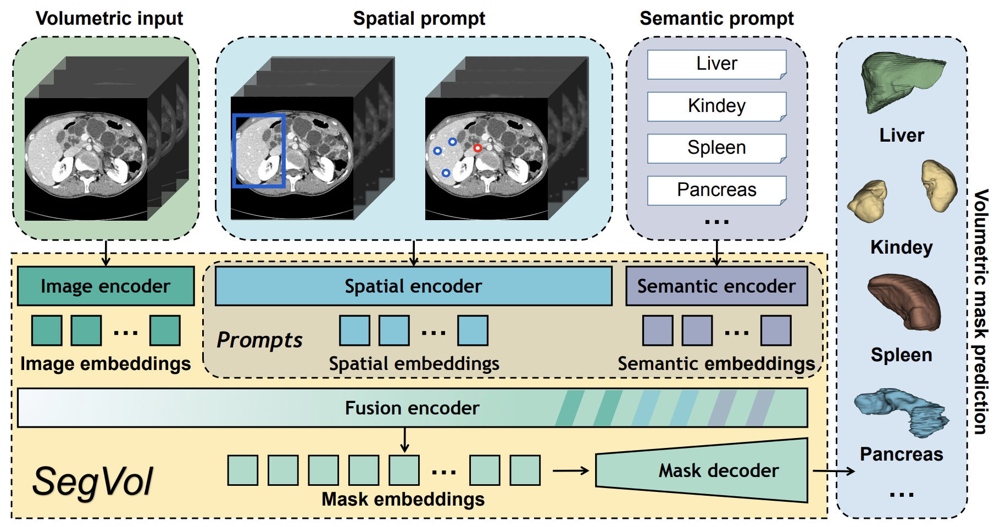
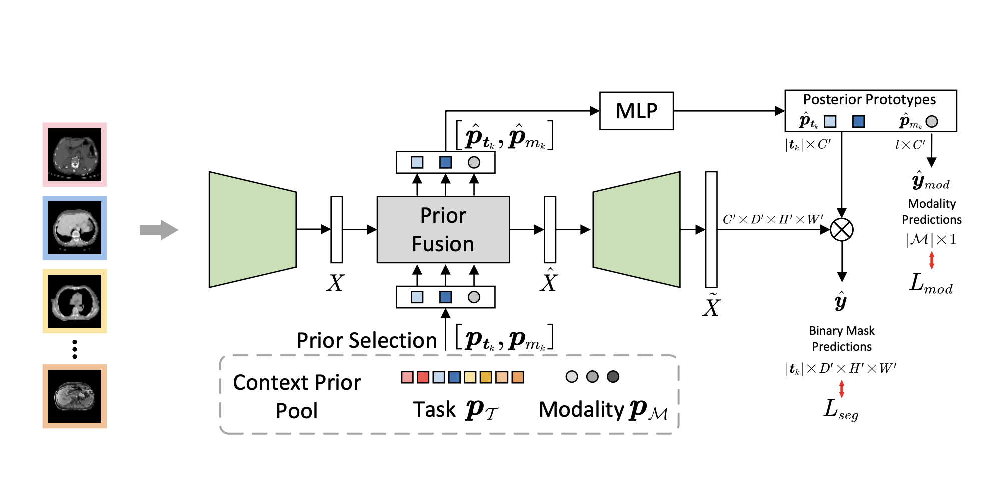

# SegEVOLution: Enhanced Medical Image Segmentation with Multimodality Learning

Medical image segmentation (MIS) is a significant challenge in the field of computer vision due to several complexities. Firstly, the data comprises various image modalities, such as Computed Tomography (CT), Magnetic Resonance Imaging (MRI), Endoscopy, and Ultrasound (US), each employing fundamentally different techniques. Secondly, these medical images target different parts of the human anatomy, resulting in substantial variations in label space and data distribution. Thirdly, unlike conventional images, acquiring large-scale medical data is challenging due to the high costs of annotation and privacy concerns. This difficulty is exacerbated in the case of volumetric (3D) medical images, which are particularly hard to obtain, store, and annotate, and require significant computational resources for processing [[1]](#ref1). Consequently, developing a universal model that demonstrates robust and consistent performance across the entire MIS domain is exceptionally challenging.

This study focuses on SegVol [[1]](#ref1), a foundation model designed for MIS and pre-trained on CT volumes. Notably, SegVol exhibits promising zero-shot performance on MRI data. Our objective is to evaluate the transferability of SegVol's CT pre-training to MRI data through fine-tuning techniques. Our approach comprises two main strategies: First, we will quantitatively evaluate SegVol's performance under controlled input distribution shifts within the MRI modality. Second, we aim to enhance SegVol's performance in the MRI domain by employing advanced prompts, parameter-efficient fine-tuning, and modality-specific priors. Additionally, we will assess the impact of fine-tuning on SegVol's performance in the CT domain. Broadly, this work seeks to provide insights into the adaptability of MIS models across different medical imaging modalities.

## Background

Recently, several large-scale models have been proposed to address the challenges of universality and robustness in image segmentation across both natural and medical domains. Notably, the Segment Anything Model (SAM) [[2]](#ref2) is a large pre-trained foundation model specifically designed for image segmentation, demonstrating impressive results on various tasks, including segmentation of out-of-distribution samples. However, subsequent studies have revealed that despite SAM’s exceptional performance on natural images, it underperforms on most medical image segmentation (MIS) tasks, such as organ, tumor, and lesion segmentation across CT, MRI, and Ultrasound modalities [[3]](#ref3) [[4]](#ref4) [[5]](#ref5) [[6]](#ref6) [[7]](#ref7).

To address these limitations, several new methods have been proposed to adapt SAM for improved performance on MIS tasks [[8]](#ref8) [[9]](#ref9) [[10]](#ref10). SAM-Med2D [[9]](#ref9) is a fine-tuned version of SAM trained on 19.7 million 2D masks from various body parts and imaging techniques. This version incorporates learnable adapter layers in each Transformer block, allowing the model to acquire domain-specific knowledge crucial for medical image segmentation. Point prompts, bounding box prompts, and mask prompts play crucial roles in guiding the model to specific regions of interest within medical images. Despite the adaptation, treating 3D images such as CT and MRI as independent 2D slices is suboptimal.

Haoyu Wang et al. (2023) [[10]](#ref10) reformulated SAM into a 3D architecture, called SAM-Med3D, and trained it on 131,000 3D masks across 247 categories. Unlike SAM-Med2D, which treats volumetric data as individual 2D slices, SAM-Med3D processes the data in its entirety using a 3D decoder. This method allows SAM-Med3D to capture more spatial context and generate higher quality masks with significantly fewer point prompts compared to SAM-Med2D. However, SAM-Med3D still faces challenges in processing large inputs due to its volumetric design and does not support segmentation using semantic prompts.

Most recently, Du et al. (2024) proposed SegVol [[1]](#ref1), a volumetric model pre-trained on a large collection of CT images from various segmentation datasets. The authors claim that SegVol generalizes remarkably well to unseen data, achieving state-of-the-art zero-shot performance on most MIS tasks. SegVol employs composite-type prompts that combine semantic and spatial information, significantly enhancing its segmentation accuracy. Additionally, the authors introduced a novel zoom-in-zoom-out method for inference, which significantly reduces the computational cost of volumetric image segmentation while effectively utilizing the 3D structure's information. Despite being explicitly trained on CT images, SegVol demonstrates good zero-shot performance in the MRI domain, underscoring its versatility.

To develop a truly universal medical image segmentation model, Gao et al. (2024) proposed Hermes [[11]](#ref11), which learns task- and modality-specific priors inspired by the training program of medical radiology residents. Hermes integrates these priors through context-aware sampling based on the input image's modality (e.g., MRI, CT, PET) and the task description. This approach allows Hermes to adapt dynamically to different segmentation challenges, offering a significant improvement over single-task models. Contextual prompts derived from the learned priors are used to adapt the model’s segmentation strategy dynamically. Hermes has been shown to be competitive with, or even outperform, state-of-the-art task- and modality-specific approaches across a wide range of benchmarks.

## Methodology

### Context-prior learning

Medical segmentation models focus predominantly on fine-tuning to specific modalities. However, this detracts from their generalizability and prevents learning of features useful across modalities. SegVol is a state-of-the-art model for medical image segmentation on the CT modality. Whereas it shows promising zero-shot results on the MRI modality, it underperforms compared to specialized MRI segmentation models. We aim to bring the performance of SegVol to state-of-the-art on the MRI modality, while preserving its performance on the CT modality. To that end we explore learning context-prior tokens for each task and modality (as proposed for medical image segmentation by [Gao et al. 2024](https://arxiv.org/pdf/2306.02416)). The idea is to let the segmentation model learn modality- and task-specific tokens that condition image encoding and mask decoding. These tokens are then fused via a transformer with the image representations from the image encoder, resulting in an updated image representation and updated context-prior tokens. The updated image representations are fed to the mask decoder. An MLP is applied on top of the updated context-prior tokens to generate posterior prototypes. The updated image representation and posterior prototypes are multiplied to obtain the final binary mask predictions. The resulting model is called Hermes. Hermes shows improvements over existing task-specific approaches across tasks and modalities. However, it is inferior to SegVol. Hence, we aim to combine the strengths of SegVol and Hermes to achieve state-of-the-art performance on both the CT and MRI modalities.

### Architecture overview

SegVol | Hermes
:------:|:------:
 | 

Hermes has been shown to be compatible with existing backbones, including ViT, as used in SegVol. SegVol builds on top of Segment Anything (SAM), with image, spatial and semantic embeddings fused and fed to the mask decoder. In case of Hermes, the reference architecture is similar: an image encoder, followed by fusion of image embeddings and context prior tokens, and then followed by a mask decoder.

**Proposed approach to applying SegVol to Hermes:**
We apply the approach taken by Hermes to the pre-trained SegVol model. Following the approach from the Hermes paper, we introduce context priors, a posterior prototype MLP, and add adapters to image encoder, fusion encoder and mask decoder.
Currently, we are still experimenting with the precise architecture that would yield the best results. However, conceptually it looks as follows:

### Datasets

We chose to focus on prostate MRI data, as there are several datasets avaiable amounting to over 400 annotated volumes, and the prostate is a well-defined structure that is easy to segment. We have developed a pre-processing pipeline, and pre-processed MSD, PROMISE12, SAML and T2W datasets in a format compatible with SegVol.

## Results
Based on preliminary evaluation, we have reproduced SegVol performance on CT and MRI data, obtaining results as reporting in the SegVol paper.

| **Training Method**       | **Training Data**                         | **Expected Outcome**                                    | **Results**                         |
|---------------------------|-------------------------------------------|--------------------------------------------------------|-------------------------------------|
| **LoRA**                  | CT (all)                                  | Baseline performance on CT                             | TBD                                 |
|                           | MRI (all)                                 | Baseline performance on MRI                            | TBD                                 |
|                           | MRI Prostate                              | Performance on MRI prostate                            | TBD                                 |
|                           | MRI Brain                                 | Performance on MRI brain                               | TBD                                 |
| **Context Priors**        | CT (all)                                  | Expected to perform better than LoRA on CT             | TBD                                 |
|                           | MRI (all)                                 | Expected to perform better than LoRA on MRI            | TBD                                 |
|                           | MRI Prostate                              | Potential improvement over LoRA on MRI prostate        | TBD                                 |
|                           | MRI Brain                                 | Potential improvement over LoRA on MRI brain           | TBD                                 |

## References

<a name="ref1">[1]</a>: Du, Yuxin, Fan Bai, Tiejun Huang, and Bo Zhao. 2024. “SegVol: Universal
and Interactive Volumetric Medical Image Segmentation.”
<https://arxiv.org/abs/2311.13385>.

<a name="ref2">[2]</a>: Kirillov, Alexander, Eric Mintun, Nikhila Ravi, Hanzi Mao, Chloe
Rolland, Laura Gustafson, Tete Xiao, et al. 2023. “Segment Anything.” In
*Proceedings of the IEEE/CVF International Conference on Computer
Vision*, 4015–26.

<a name="ref3">[3]</a>: Ma, Jun, Yuting He, Feifei Li, Lin Han, Chenyu You, and Bo Wang. 2024.
“Segment Anything in Medical Images.” *Nature Communications* 15 (1):
654.

<a name="ref4">[4]</a>: Ji, Ge-Peng, Deng-Ping Fan, Peng Xu, Ming-Ming Cheng, Bowen Zhou, and
Luc Van Gool. 2023. “SAM Struggles in Concealed Scenes–Empirical Study
on" Segment Anything".” *arXiv Preprint arXiv:2304.06022*.

<a name="ref5">[5]</a>: Sheng, He, Rina Bao, Jingpeng Li, Patricia Grant, and Yangming Ou. 2023.
“Accuracy of Segment-Anything Model (SAM) in Medical Image Segmentation
Tasks,” April.

<a name="ref6">[6]</a>: Ji, Wei, Jingjing Li, Qi Bi, Tingwei Liu, Wenbo Li, and Li Cheng. 2024.
“Segment Anything Is Not Always Perfect: An Investigation of Sam on
Different Real-World Applications.” Springer.

<a name="ref7">[7]</a>: Roy, S, T Wald, G Koehler, MR Rokuss, N Disch, J Holzschuh, D Zimmerer,
KH Maier-Hein, and MD SAM. n.d. “Zero-Shot Medical Image Segmentation
Capabilities of the Segment Anything Model. arXiv 2023.” *arXiv Preprint
arXiv:2304.05396*.

<a name="ref8">[8]</a>: Wu, Junde, Wei Ji, Yuanpei Liu, Huazhu Fu, Min Xu, Yanwu Xu, and Yueming
Jin. 2023. “Medical SAM Adapter: Adapting Segment Anything Model for
Medical Image Segmentation.” <https://arxiv.org/abs/2304.12620>.

<a name="ref9">[9]</a>: Cheng, Junlong, Jin Ye, Zhongying Deng, Jianpin Chen, Tianbin Li, Haoyu
Wang, Yanzhou Su, et al. 2023. “Sam-Med2d.” *arXiv Preprint
arXiv:2308.16184*.

<a name="ref10">[10]</a>: Wang, Haoyu, Sizheng Guo, Jin Ye, Zhongying Deng, Junlong Cheng, Tianbin
Li, Jianpin Chen, et al. 2023. “Sam-Med3d.” *arXiv Preprint
arXiv:2310.15161*.

<a name="ref11">[11]</a>: Gao, Yunhe, Zhuowei Li, Di Liu, Mu Zhou, Shaoting Zhang, and Dimitris N.
Metaxas. 2024. “Training Like a Medical Resident: Context-Prior Learning
Toward Universal Medical Image Segmentation.”
<https://arxiv.org/abs/2306.02416>.
