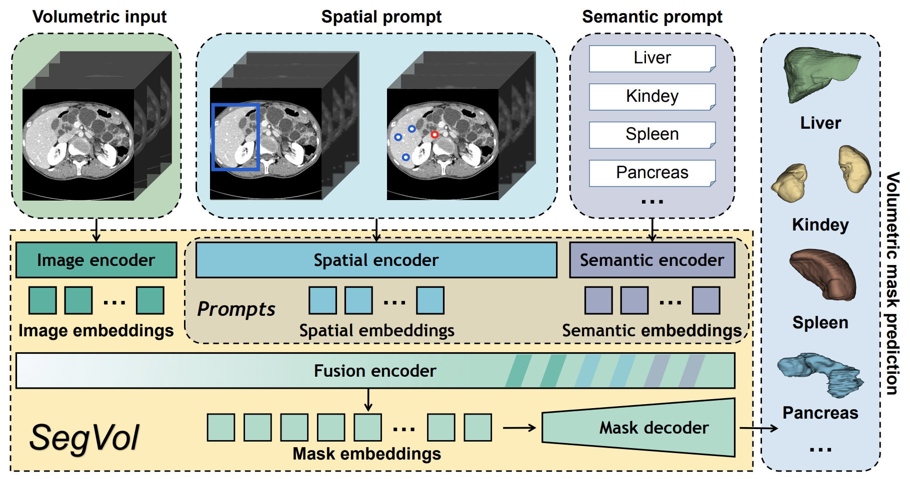
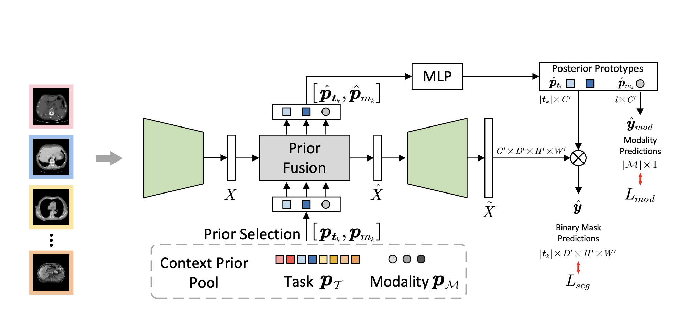
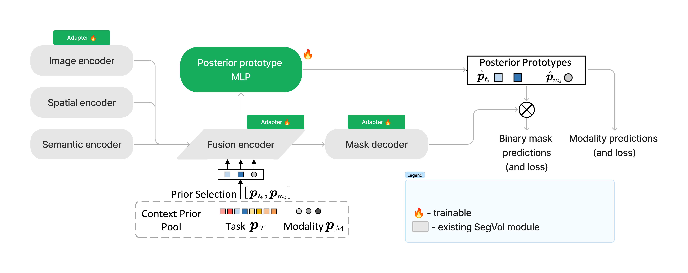

## Context-prior learning
Medical segmentation models focus predominantly on fine-tuning to specific modalities. However, this detracts from their generalizability and prevents learning of features useful across modalities. SegVol is a state-of-the-art model for medical image segmentation on the CT modality. Whereas it shows promising zero-shot results on the MRI modality, it underperforms compared to specialized MRI segmentation models. We aim to bring the performance of SegVol to state-of-the-art on the MRI modality, while preserving its performance on the CT modality. To that end we explore learning context-prior tokens for each task and modality (as proposed for medical image segmentation by [Gao et al. 2024](https://arxiv.org/pdf/2306.02416)). The idea is to let the segmentation model learn modality- and task-specific tokens that condition image encoding and mask decoding. These tokens are then fused via a transformer with the image representations from the image encoder, resulting in an updated image representation and updated context-prior tokens. The updated image representations are fed to the mask decoder. An MLP is applied on top of the updated context-prior tokens to generate posterior prototypes. The updated image representation and posterior prototypes are multiplied to obtain the final binary mask predictions. The resulting model is called Hermes. Hermes shows improvements over existing task-specific approaches across tasks and modalities. However, it is inferior to SegVol. Hence, we aim to combine the strengths of SegVol and Hermes to achieve state-of-the-art performance on both the CT and MRI modalities.

### Architecture overview

SegVol | Hermes
:------:|:------:
 | 

Hermes has been shown to be compatible with existing backbones, including ViT, as used in SegVol. SegVol builds on top of Segment Anything (SAM), with image, spatial and semantic embeddings fused and fed to the mask decoder. In case of Hermes, the reference architecture is similar: an image encoder, followed by fusion of image embeddings and context prior tokens, and then followed by a mask decoder.

**Proposed approach to applying SegVol to Hermes:**
We apply the approach taken by Hermes to the pre-trained SegVol model. Following the approach from the Hermes paper, we introduce context priors, a posterior prototype MLP, and add adapters to image encoder, fusion encoder and mask decoder.
Currently, we are still experimenting with the precise architecture that would yield the best results. However, conceptually it looks as follows:

