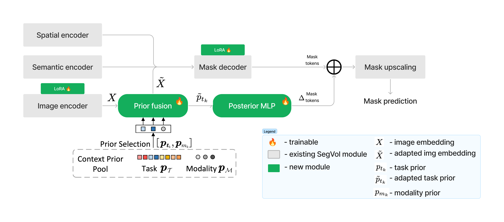

# SegEVOLution: Enhanced Medical Image Segmentation with Multimodality Learning

Medical image segmentation (MIS) is a prevailing problem in the field of
computer vision. The problem is non-trivial for several reasons. First,
the data may come from a multitude of sub-domains of medical images such
as Computerized Tomography (CT), Magnetic Resonance Imaging (MRI),
Endoscopy, and Ultrasound (US). All of these are radically different
techniques. Second, medical images depict different parts of the human
body, so the label space and data distribution may vary significantly as
well. Third, contrary to regular images, is it difficult to obtain large
scales of medical data, mainly due to extremely high annotation costs
and privacy concerns. This is particularly true for volumetric (i.e. 3D)
medical images, which are hard to obtain, store and annotate. Even
processing them usually comes with a high computational cost (Du et al.
2024). For all these reasons, it is challenging to train a “universal”
model, with robust and consistent performance over the complete MIS
domain.

In this work, we will focus on SegVol, a foundation model designed for
MIS and pre-trained on CT volumes. Interestingly, it shows promising
zero-shot results on MRI data. We aim to assess the transferability of
SegVol’s pre-training on CT data to MRI data, beyond zero-shot, by
applying fine-tuning techniques. Our approach is twofold: Firstly, we
intend to quantitatively evaluate SegVol’s performance on controlled
input distribution shifts across different modalities (MRI in
particular), transformations, and image complexities. Secondly, we plan
to improve SegVol’s performance specifically in the MRI domain by
incorporating enhanced prompts, parameter-efficient fine-tuning, and
modality-dependent priors, w hile also assessing the impact of
fine-tuning on SegVol’s CT performance. More broadly, we hope that this
work will provide insights into the adaptability of MIS models across
different medical imaging modalities.

## Background

Recently, several large-scale models were proposed to tackle the
problems of universality and robustness of image segmentation in both
the natural and the medical domains. Most remarkably, the Segment
Anything Model (SAM) (Kirillov et al. 2023) is a large pre-trained
foundation model designed specifically for image segmentation and has
shown impressive results on many tasks, including segmentation over
out-of-distribution samples. Subsequent work has shown that, despite
SAM’s unparalleled performance over non-medical images (or *natural*),
it has poor performance on most MIS tasks (Ma et al. 2024; G.-P. Ji et
al. 2023; Sheng et al. 2023; W. Ji et al. 2024; Roy et al., n.d.; Y. Ji
et al. 2022, among others).

Several new methods were proposed to overcome this limitation, which
tries to fine-tune SAM (Wu et al. 2023; Cheng et al. 2023; Haoyu Wang
et al. 2023) to boost its performance over these tasks. SAM-Med2D by
(Cheng et al. 2023) in particular has shown state-of-the-art performance
in two-dimensional MIS, which has later been extended to the
three-dimensional (or *volumetric*) domain by (Haoyu Wang et al. 2023)
in their proposed model, SAM-Med3D. Despite its remarkable performance,
SAM-Med3D still struggles to process large inputs and does not support
*semantic* segmentation.

Most recently, (Du et al. 2024) has proposed SegVol, which is a
foundation model, pre-trained specifically on a large collection of
medical images and then fine-tuned on several different segmentation
datasets. The authors of (Du et al. 2024) claim that SegVol generalizes
remarkably well to unseen data and has state-of-the-art zero-shot
performance over most MIS tasks. Most curiously, SegVol was trained
explicitly on Computerized Tomography (CT) images and the authors show
that it has good zero-shot performance over the Magnetic Resonance
Imaging (MRI) domain. Finally, the authors claim to have used a novel
zoom-in-zoom-out method for inference which significantly reduces the
computational cost of image segmentation, while being able to handle
volumetric (i.e. 3D) input and output (Du et al. 2024).

Finally, to train a truly universal medical image segmentation model,
(Gao et al. 2024) proposes Hermes, an MIS model with learned task- and
modality-specific priors. More precisely, they train a pool of "priors",
from which Hermes performs context-aware sampling, given an input image
of some modality (e.g. MRI, CT, PET, etc.) and some task description.
Segmentation masks are inferred from the hidden representations,
obtained by fusing the input image representation with the learned
priors. As a result, Hermes is reported to be competitive or even
outperform state-of-the-art task- and modality-specific approaches on a
wide range of benchmarks.

## Methodology

### Context-prior learning

Medical segmentation models focus predominantly on fine-tuning to specific modalities. However, this detracts from their generalizability and prevents learning of features useful across modalities. SegVol is a state-of-the-art model for medical image segmentation on the CT modality. Whereas it shows promising zero-shot results on the MRI modality, it underperforms compared to specialized MRI segmentation models. We aim to bring the performance of SegVol to state-of-the-art on the MRI modality, while preserving its performance on the CT modality. To that end we explore learning context-prior tokens for each task and modality (as proposed for medical image segmentation by [Gao et al. 2024](https://arxiv.org/pdf/2306.02416)). The idea is to let the segmentation model learn modality- and task-specific tokens that condition image encoding and mask decoding. These tokens are then fused via a transformer with the image representations from the image encoder, resulting in an updated image representation and updated context-prior tokens. The updated image representations are fed to the mask decoder. An MLP is applied on top of the updated context-prior tokens to generate posterior prototypes. The updated image representation and posterior prototypes are multiplied to obtain the final binary mask predictions. The resulting model is called Hermes. Hermes shows improvements over existing task-specific approaches across tasks and modalities. However, it is inferior to SegVol. Hence, we aim to combine the strengths of SegVol and Hermes to achieve state-of-the-art performance on both the CT and MRI modalities.

### Architecture overview

SegVol | Hermes
:------:|:------:
 | 

Hermes has been shown to be compatible with existing backbones, including ViT, as used in SegVol. SegVol builds on top of Segment Anything (SAM), with image, spatial and semantic embeddings fused and fed to the mask decoder. In case of Hermes, the reference architecture is similar: an image encoder, followed by fusion of image embeddings and context prior tokens, and then followed by a mask decoder.

**Proposed approach to applying SegVol to Hermes:**
We apply the approach taken by Hermes to the pre-trained SegVol model. Following the approach from the Hermes paper, we introduce context priors, a posterior prototype MLP, and add adapters to image encoder, fusion encoder and mask decoder.
Currently, we are still experimenting with the precise architecture that would yield the best results. However, conceptually it looks as follows:

### Datasets

We chose to focus on prostate MRI data, as there are several datasets avaiable amounting to over 400 annotated volumes, and the prostate is a well-defined structure that is easy to segment. We have developed a pre-processing pipeline, and pre-processed MSD, PROMISE12, SAML and T2W datasets in a format compatible with SegVol.

## Results
Based on preliminary evaluation, we have reproduced SegVol performance on CT and MRI data, obtaining results as reporting in the SegVol paper.

## References

Cheng, Junlong, Jin Ye, Zhongying Deng, Jianpin Chen, Tianbin Li, Haoyu
Wang, Yanzhou Su, et al. 2023. “Sam-Med2d.” *arXiv Preprint
arXiv:2308.16184*.

Ding, Ning, Yujia Qin, Guang Yang, Fuchao Wei, Zonghan Yang, Yusheng Su,
Shengding Hu, et al. 2022. “Delta Tuning: A Comprehensive Study of
Parameter Efficient Methods for Pre-Trained Language Models.”
<https://arxiv.org/abs/2203.06904>.

Du, Yuxin, Fan Bai, Tiejun Huang, and Bo Zhao. 2024. “SegVol: Universal
and Interactive Volumetric Medical Image Segmentation.”
<https://arxiv.org/abs/2311.13385>.

Gao, Yunhe, Zhuowei Li, Di Liu, Mu Zhou, Shaoting Zhang, and Dimitris N.
Metaxas. 2024. “Training Like a Medical Resident: Context-Prior Learning
Toward Universal Medical Image Segmentation.”
<https://arxiv.org/abs/2306.02416>.

Hu, Edward J., Yelong Shen, Phillip Wallis, Zeyuan Allen-Zhu, Yuanzhi
Li, Shean Wang, Lu Wang, and Weizhu Chen. 2021. “LoRA: Low-Rank
Adaptation of Large Language Models.”
<https://arxiv.org/abs/2106.09685>.

Ji, Ge-Peng, Deng-Ping Fan, Peng Xu, Ming-Ming Cheng, Bowen Zhou, and
Luc Van Gool. 2023. “SAM Struggles in Concealed Scenes–Empirical Study
on" Segment Anything".” *arXiv Preprint arXiv:2304.06022*.

Ji, Wei, Jingjing Li, Qi Bi, Tingwei Liu, Wenbo Li, and Li Cheng. 2024.
“Segment Anything Is Not Always Perfect: An Investigation of Sam on
Different Real-World Applications.” Springer.

Ji, Yuanfeng, Haotian Bai, Chongjian Ge, Jie Yang, Ye Zhu, Ruimao Zhang,
Zhen Li, et al. 2022. “Amos: A Large-Scale Abdominal Multi-Organ
Benchmark for Versatile Medical Image Segmentation.” *Advances in Neural
Information Processing Systems* 35: 36722–32.

Kirillov, Alexander, Eric Mintun, Nikhila Ravi, Hanzi Mao, Chloe
Rolland, Laura Gustafson, Tete Xiao, et al. 2023. “Segment Anything.” In
*Proceedings of the IEEE/CVF International Conference on Computer
Vision*, 4015–26.

Ma, Jun, Yuting He, Feifei Li, Lin Han, Chenyu You, and Bo Wang. 2024.
“Segment Anything in Medical Images.” *Nature Communications* 15 (1):
654.

Mangrulkar, Sourab, Sylvain Gugger, Lysandre Debut, Younes Belkada,
Sayak Paul, and Benjamin Bossan. 2022. “PEFT: State-of-the-Art
Parameter-Efficient Fine-Tuning Methods.”
<https://github.com/huggingface/peft>.

Petitjean, Caroline. 2019. “Current Methods in Medical Image
Segmentation.” *Journal of Imaging* 5.

Roy, S, T Wald, G Koehler, MR Rokuss, N Disch, J Holzschuh, D Zimmerer,
KH Maier-Hein, and MD SAM. n.d. “Zero-Shot Medical Image Segmentation
Capabilities of the Segment Anything Model. arXiv 2023.” *arXiv Preprint
arXiv:2304.05396*.

Sheng, He, Rina Bao, Jingpeng Li, Patricia Grant, and Yangming Ou. 2023.
“Accuracy of Segment-Anything Model (SAM) in Medical Image Segmentation
Tasks,” April.

Valdagni, Riccardo, Marco Montorsi, and Tiziana Rancati. 2023.
“Automatic Segmentation with Deep Learning in Radiotherapy.” *Cancers*
15 (17): 4389.

Wang, Haoyu, Sizheng Guo, Jin Ye, Zhongying Deng, Junlong Cheng, Tianbin
Li, Jianpin Chen, et al. 2023. “Sam-Med3d.” *arXiv Preprint
arXiv:2310.15161*.

Wang, Huaijun, and Xinhong Hei. 2024. “Automatic Medical Image
Segmentation with Vision Transformer.” *Applied Sciences* 14 (7): 2741.

Wu, Junde, Wei Ji, Yuanpei Liu, Huazhu Fu, Min Xu, Yanwu Xu, and Yueming
Jin. 2023. “Medical SAM Adapter: Adapting Segment Anything Model for
Medical Image Segmentation.” <https://arxiv.org/abs/2304.12620>.

